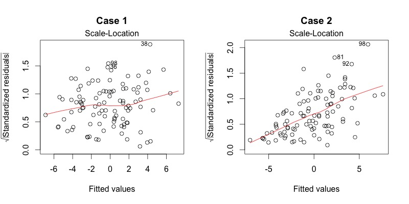

```{r setup, include=FALSE}
knitr::opts_chunk$set(echo = TRUE)
```

# Understanding Diagnostic Plots for Linear Regression Analysis

You ran a linear regression analysis and the stats software spit out a bunch of numbers. The results were significant (or not). You might think that you’re done with analysis. No, not yet. After running a regression analysis, you should check if the model works well for data.

We can check if a model works well for data in many different ways. We pay great attention to regression results, such as slope coefficients, p-values, or R2 that tell us how well a model represents given data. That’s not the whole picture though. Residuals could show how poorly a model represents data. Residuals are leftover of the outcome variable after fitting a model (predictors) to data and they could reveal unexplained patterns in the data by the fitted model. Using this information, not only could you check if linear regression assumptions are met, but you could improve your model in an exploratory way.

In this post, I’ll walk you through built-in diagnostic plots for linear regression analysis in R (there are many other ways to explore data and diagnose linear models other than the built-in base R function though!). It’s very easy to run: just use a plot() to an lm object after running an analysis. Then R will show you four diagnostic plots one by one. For example:

```{r}
data(women) # Load a built-in data called ‘women’
fit = lm(weight ~ height, women) # Run a regression analysis
plot(fit)
```

Tip: It’s always a good idea to check Help page, which has hidden tips not mentioned here! ?plot.lm

By the way, if you want to look at four plots at once rather than one by one:

```{r}
par(mfrow=c(2,2)) # Change the panel layout to 2 x 2
plot(fit)
par(mfrow=c(1,1)) # Change back to 1 x 1
```

You will often see numbers next to some points in each plot. They are extreme values based on each criterion and identified by the row numbers in the data set. I’ll talk about this again later.

The diagnostic plots show residuals in four different ways. Let’s take a look at the first type of plot:

1. Residuals vs Fitted

This plot shows if residuals have non-linear patterns. There could be a non-linear relationship between predictor variables and an outcome variable and the pattern could show up in this plot if the model doesn’t capture the non-linear relationship. If you find equally spread residuals around a horizontal line without distinct patterns, that is a good indication you don’t have non-linear relationships.

Let’s look at residual plots from a ‘good’ model and a ‘bad’ model. The good model data are simulated in a way that meets the regression assumptions very well, while the bad model data are not.


```{r echo=FALSE, out.width='100%',  fig.pos="H"}
knitr::include_graphics('Images/diagnostics1.jpeg')
```

What do you think? Do you see differences between the two cases? I don’t see any distinctive pattern in Case 1, but I see a parabola in Case 2, where the non-linear relationship was not explained by the model and was left out in the residuals.

2. Normal Q-Q

This plot shows if residuals are normally distributed. Do residuals follow a straight line well or do they deviate severely? It’s good if residuals are lined well on the straight dashed line.


```{r echo=FALSE, out.width='100%',  fig.pos="H"}
knitr::include_graphics('Images/diagnostics2.jpeg')
```

What do you think? Of course they wouldn’t be a perfect straight line and this will be your call. Case 2 definitely concerns me. I would not be concerned by Case 1 too much, although an observation numbered as 38 looks a little off. Let’s look at the next plot while keeping in mind that #38 might be a potential problem.

For more detailed information, see Understanding Q-Q plots.

3. Scale-Location

It’s also called Spread-Location plot. This plot shows if residuals are spread equally along the ranges of predictors. This is how you can check the assumption of equal variance (homoscedasticity). It’s good if you see a horizontal line with equally (randomly) spread points.


```{r echo=FALSE, out.width='100%',  fig.pos="H"}

```

What do you think? In Case 1, the residuals appear randomly spread. Whereas, in Case 2, the residuals begin to spread wider along the x-axis as it passes around 5. Because the residuals spread wider and wider, the red smooth line is not horizontal and shows a steep angle in Case 2.

4. Residuals vs Leverage

This plot helps us to find influential cases (i.e., subjects) if any. Not all outliers are influential in linear regression analysis (whatever outliers mean). Even though data have extreme values, they might not be influential to determine a regression line. That means, the results wouldn’t be much different if we either include or exclude them from analysis. They follow the trend in the majority of cases and they don’t really matter; they are not influential. On the other hand, some cases could be very influential even if they look to be within a reasonable range of the values. They could be extreme cases against a regression line and can alter the results if we exclude them from analysis. Another way to put it is that they don’t get along with the trend in the majority of the cases.

Unlike the other plots, this time patterns are not relevant. We watch out for outlying values at the upper right corner or at the lower right corner. Those spots are the places where cases can be influential against a regression line. Look for cases outside of a dashed line, Cook’s distance. When cases are outside of the Cook’s distance (meaning they have high Cook’s distance scores), the cases are influential to the regression results. The regression results will be altered if we exclude those cases.


```{r echo=FALSE, out.width='100%',  fig.pos="H"}
knitr::include_graphics('Images/diagnostics5.jpeg')
```

Case 1 is the typical look when there is no influential case, or cases. You can barely see Cook’s distance lines (a red dashed line) because all cases are well inside of the Cook’s distance lines. In Case 2, a case is far beyond the Cook’s distance lines (the other residuals appear clustered on the left because the second plot is scaled to show larger area than the first plot). The plot identified the influential observation as #49. If I exclude the 49th case from the analysis, the slope coefficient changes from 2.14 to 2.68 and R2 from .757 to .851. Pretty big impact!

The four plots show potential problematic cases with the row numbers of the data in the dataset. If some cases are identified across all four plots, you might want to take a close look at them individually. Is there anything special for the subject? Or could it be simply errors in data entry?

So, what does having patterns in residuals mean to your research? It’s not just a go-or-stop sign. It tells you about your model and data. Your current model might not be the best way to understand your data if there’s so much good stuff left in the data.

In that case, you may want to go back to your theory and hypotheses. Is it really a linear relationship between the predictors and the outcome? You may want to include a quadratic term, for example. A log transformation may better represent the phenomena that you’d like to model. Or, is there any important variable that you left out from your model? Other variables you didn’t include (e.g., age or gender) may play an important role in your model and data. Or, maybe, your data were systematically biased when collecting data. You may want to redesign data collection methods.

Checking residuals is a way to discover new insights in your model and data!

This post was modified from the UVA Library StatLab website: https://data.library.virginia.edu/diagnostic-plots/

